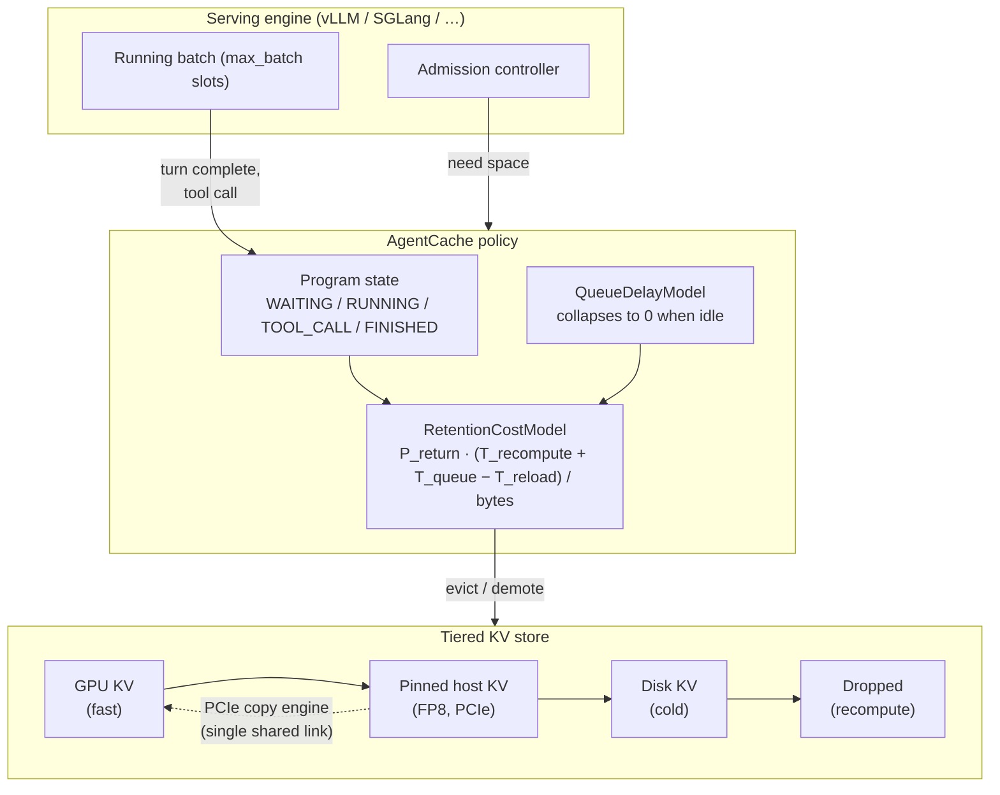

# AgentCache

> Agent-aware KV-cache retention for multi-turn LLM agent serving.

[](https://www.python.org)
[](LICENSE)

AgentCache is a drop-in KV-cache eviction policy for serving LLM **agents** —
multi-turn programs that pause on tool calls, then come back with a prefix
that is almost entirely identical to what they just used. Production engines
evict that KV with **LRU** (optionally offloading to a host tier). LRU answers
the wrong question for agents: a program blocked on a tool call looks *exactly
like* a dead program — its blocks are the oldest in the pool — yet it is
guaranteed to return.

AgentCache instead asks: *if I drop this block, what will it cost me later?*
and prices that cost with a queueing term that every prior system (InferCept,
LMCache, vLLM prefix cache) leaves out.

---

## Why this is interesting

A multi-turn agent trajectory is not a chat session. Between turns the program
is **not finished** — it is blocked on a tool call for seconds to minutes and
will resume with a near-identical prefix. Two consequences:

1. The **return probability** of a block is known from program state, not
   learned. A context parked on `TOOL_CALL` will almost certainly come back;
   a `FINISHED` context will not.
2. The cost of dropping a block is dominated by **queueing**, not recompute.
   A dropped program loses its batch slot and re-enters the admission queue.
   Under load the wait — not the prefill — is what the user feels. This term
   is invisible to offline profiling because it only exists under contention.

### The cost model

```
value(b) = P_return(b) · ( T_recompute + T_queue − T_reload ) / bytes(b)
```

Evict in ascending `value` (GreedyDual-Size: divide by size so a big block
must justify its footprint). The three terms:

| Term | Meaning | Modelled by |
|------|---------|-------------|
| `T_recompute` | prefill to rebuild the KV | InferCept ✓, here ✓ |
| `−T_reload` | what you'd pay anyway by demoting to CPU | InferCept ✓, here ✓ |
| `T_queue` | **lost batch-slot wait under contention** | InferCept ✗, here ✓ |

---

## Architecture



The **core** (`config`, `types`, `policy`, `tiering`, `sim`) is pure stdlib and
runs on any machine. The GPU pieces — the Triton FP8 gather+pack kernel and
the vLLM `KVConnector` — are optional extras imported lazily, so `import
agentcache` never pulls in torch.

---

## Quick start

```bash
# core + simulator install in seconds (no torch needed)
pip install -e .

# run the policy comparison used in this README
python benchmarks/run_ablation.py

# or drive the simulator directly
PYTHONPATH=src python - <<'PY'
from agentcache.config import HardwareConfig, SystemConfig
from agentcache.sim import generate_programs, run_comparison, speedup_table

cfg = SystemConfig(
    hardware=HardwareConfig(gpu_kv_capacity_bytes=8*1024**3,
                            cpu_kv_capacity_bytes=8*1024**3),
    max_batch_size=8,
)
progs = generate_programs("code-agent", num_programs=32,
                          arrival_rate_qps=0.5, seed=1)
for row in speedup_table(run_comparison(progs, cfg,
                         ("lru", "lru-offload", "agentcache", "oracle"))):
    print(row["policy"], round(row["TTFT p50 (ms)"]), "ms",
          f"speedup={row['TTFT speedup']:.2f}x")
PY
```

---

## Results

Simulated on one RTX-4090-class GPU (Llama-3.1-8B, FP16), **8 GiB GPU KV /
8 GiB host KV**, batch size 8, `code-agent` trace, 32 programs, arrival 0.5
qps. Numbers are reproducible via `benchmarks/run_ablation.py`.

| Policy | TTFT p50 (ms) | TTFT p95 (ms) | Cache hit | TTFT speedup¹ | Recompute tok |
|--------|-------------:|-------------:|----------:|--------------:|--------------:|
| `lru` (drop) | 15166 | 23227 | 2.4% | 0.83× | 5.31 M |
| `lru-offload` (baseline) | 12594 | 19571 | 49.7% | 1.00× | 2.74 M |
| **`agentcache`** | **11084** | 19710 | **66.2%** | **1.14×** | **1.83 M** |
| `agentcache-block` (ablation: block-granular) | 11885 | 20815 | 49.3% | 1.06× | 2.73 M |
| `agentcache-no-queue` (ablation: drop T_queue) | 11562 | 19505 | 62.2% | 1.09× | 2.04 M |
| `oracle` (Belady upper bound) | 11595 | 19186 | 65.5% | 1.09× | 1.89 M |

¹ Speedup is **always** stated against the strong baseline (`lru-offload`),
never against plain LRU. Reporting raw numbers is how people accidentally
claim 10×.

**What the table says.**

- AgentCache cuts TTFT p50 by **13.6%** versus the strong baseline and lands
  **within ~4% of the oracle** — i.e. there is little headroom left to squeeze
  out of the policy itself; the rest is engineering.
- The **program-granular** ablation (`agentcache-block`) collapses to the
  baseline's 49% hit rate. Evicting *whole programs* rather than scattered
  blocks is the single biggest lever — a half-evicted program still can't serve
  its next turn without a tail recompute.
- The **queue term** (`agentcache-no-queue`) costs ~5 points of speedup. Under
  contention, pricing the lost batch slot is what separates this from an
  InferCept-style recompute/reload comparison.

> **Honesty note.** The advantage is real but *modest* and regime-dependent.
> With a large host tier and light load, `lru-offload`'s brute-force
> offload-everything catches up on hit rate — AgentCache's edge is largest when
> the host tier is capacity-constrained, which is exactly the regime a single
> 4090 lives in. See `docs/validation.md` for the simulator-vs-real-engine gap
> and `docs/design.md` for the full reasoning.

---

## Repository layout

```
agentcache/
├── src/agentcache/
│   ├── config.py          # hardware + system knobs (4090 defaults)
│   ├── types.py           # Tier, ProgramState, BlockMeta, AgentProgram, ...
│   ├── policy/            # eviction policies + the cost model
│   │   ├── cost_model.py  #   P_return · (T_recompute + T_queue − T_reload)
│   │   ├── agentcache.py  #   the agent-aware policy
│   │   ├── lru.py         #   LRU + LRU-offload baselines
│   │   └── oracle.py      #   Belady upper bound
│   ├── tiering/           # tiered KV store (metadata) + backends
│   │   ├── manager.py     #   lookup / truncate / evict / promote
│   │   └── backend.py     #   NullBackend (sim) + PinnedHostBackend (torch)
│   └── sim/               # discrete-event simulator + synthetic workloads
├── benchmarks/
│   ├── run_ablation.py    # reproduces the table above
│   ├── run_serving_bench.py   # real-engine harness (integration)
│   ├── run_accuracy.py        # FP8 offload accuracy delta
│   ├── traces/            # shipped synthetic traces
│   └── results/           # saved simulation outputs
├── scripts/               # calibrate.py, trace_from_langsmith.py
├── docs/
│   ├── design.md          # full design writeup
│   └── validation.md      # simulator vs real engine, calibration
└── tests/                 # pytest: types, cost model, policies, manager, sim
```

---

## Extending it

The simulator and the real engine share the **same** policy and accounting
code — a bug found in simulation is a bug fixed on hardware. The integration
paths are real but require extra deps:

- **vLLM connector** (`connector/`): an out-of-tree `KVConnector` that calls
  `AgentCachePolicy` at eviction points. No vLLM fork required.
- **Triton kernel** (`kernels/gather_pack`): FP8 gather+pack so the GPU→host
  copy moves half the bytes. Optional; the backend falls back to a torch cast.
- **Calibration** (`scripts/calibrate.py`): measures the latency constants on
  your hardware and writes a JSON override consumed by `load_config()`.

---

## Project status

**Research prototype, not production.** The policy, cost model, tiered store
and simulator are complete and tested. The vLLM connector and Triton kernel
are working skeletons validated against the same interfaces; they need a CUDA
GPU and a real model to exercise end-to-end. The single-GPU numbers are
simulated, not measured on hardware — `docs/validation.md` tracks that gap
explicitly rather than hiding it.

---

## Citation

If you use AgentCache in research, cite:

```bibtex
@misc{agentcache2025,
  title  = {AgentCache: Agent-aware KV Cache Retention for Multi-turn LLM Serving},
  year   = {2025},
  note   = {https://github.com/agentcache/agentcache}
}
```
